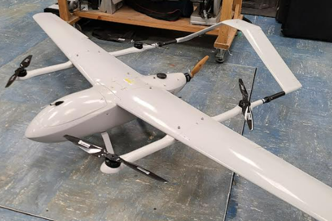

# VTOL
For typical VTOL flight you will need to have 2 sets of setpoints, pid gains, and mixers. One is for the hovering pids and another for the forward flight.
On many aircraft you will think of this as the multirotor configuration and fixed wing configuration.


## Transition
There are many different ways to code a transition from one flight configuration to another, AKA multirotor to fixed wing flight.
One such method is using an if statement to swap between flight modes. This will use an if statement to swap your setpoints, pid gains, and mixer.
Here is a pseudo-code example of that:

```
/// SETPOINT CODE
float setpoints_rpy[AXIS_COUNT]; // these are the desired attitudes or rotation

if (rc_channels[RC_TRANSITION] > 0.5f) {
    // this is fixed wing mode
    // these values are examples and should not just be copied over
    if (rc_channels[RC_FLIGHT_MODE] > 0.55) { // When RC_FLIGHT_MODE switch is high we are in attitude mode        
        float max_attitude = 45.0f;
        setpoints_rpy[AXIS_ROLL] = rcCurve(rc_channels[RC_ROLL], 0.5f, max_attitude); // scaled value, expo, max attitude deg
        setpoints_rpy[AXIS_PITCH] = rcCurve(rc_channels[RC_PITCH], 0.5f, max_attitude); // scaled value, expo, max attitude deg

        float max_rotation = 100.0f;
        setpoints_rpy[AXIS_YAW] = -rcCurve(rc_channels[RC_YAW], 0.5f, max_rotation); // scaled value, expo, max rotation deg/sec
    } else { // rate mode
        float max_rotation = 100.0f;

        setpoints_rpy[AXIS_ROLL] = rcCurve(rc_channels[RC_ROLL], 0.5f, max_rotation); // scaled value, expo, max rotation deg/sec
        setpoints_rpy[AXIS_PITCH] = rcCurve(rc_channels[RC_PITCH], 0.5f, max_rotation); // scaled value, expo, max rotation deg/sec
        setpoints_rpy[AXIS_YAW] = -rcCurve(rc_channels[RC_YAW], 0.5f, max_rotation); // scaled value, expo, max rotation deg/sec    
    }
} else {
    // this is multirotor mode
    // these values are examples and should not just be copied over
    if (rc_channels[RC_FLIGHT_MODE] > 0.55) { // When RC_FLIGHT_MODE switch is high we are in attitude mode        
        float max_attitude = 45.0f;
        setpoints_rpy[AXIS_ROLL] = rcCurve(rc_channels[RC_ROLL], 0.5f, max_attitude); // scaled value, expo, max attitude deg
        setpoints_rpy[AXIS_PITCH] = rcCurve(rc_channels[RC_PITCH], 0.5f, max_attitude); // scaled value, expo, max attitude deg

        float max_rotation = 300.0f;
        setpoints_rpy[AXIS_YAW] = -rcCurve(rc_channels[RC_YAW], 0.5f, max_rotation); // scaled value, expo, max rotation deg/sec
    } else { // rate mode
        float max_rotation = 300.0f;

        setpoints_rpy[AXIS_ROLL] = rcCurve(rc_channels[RC_ROLL], 0.5f, max_rotation); // scaled value, expo, max rotation deg/sec
        setpoints_rpy[AXIS_PITCH] = rcCurve(rc_channels[RC_PITCH], 0.5f, max_rotation); // scaled value, expo, max rotation deg/sec
        setpoints_rpy[AXIS_YAW] = -rcCurve(rc_channels[RC_YAW], 0.5f, max_rotation); // scaled value, expo, max rotation deg/sec    
    }
}

/// PID GAINS CODE
// update pid values based on flight mode
float roll_kp;
float roll_ki;
float roll_kd;
float roll_kff;

float pitch_kp;
float pitch_ki;
float pitch_kd;
float pitch_kff;

float yaw_kp;
float yaw_ki;
float yaw_kd;
float yaw_kff;

if (rc_channels[RC_TRANSITION] > 0.5f) {
    // this is fixed wing code
    // these values are examples and should not just be copied over
    roll_kp = 10.0f;
    roll_ki = 10.0f;
    roll_kd = 10.0f;
    roll_kff = 10.0f;

    pitch_kp = 10.0f;
    pitch_ki = 10.0f;
    pitch_kd = 10.0f;
    pitch_kff = 10.0f;

    yaw_kp = 10.0f;
    yaw_ki = 10.0f;
    yaw_kd = 10.0f;
    yaw_kff = 10.0f;
} else {
    // this is multirotor code
    // these values are examples and should not just be copied over
    roll_kp = 100.0f;
    roll_ki = 100.0f;
    roll_kd = 100.0f;
    roll_kff = 100.0f;

    pitch_kp = 100.0f;
    pitch_ki = 100.0f;
    pitch_kd = 100.0f;
    pitch_kff = 100.0f;

    yaw_kp = 100.0f;
    yaw_ki = 100.0f;
    yaw_kd = 100.0f;
    yaw_kff = 100.0f;
}

// updates pids with the new values
updatePids(
    &ratePid,
    roll_kp,
    roll_ki,
    roll_kd,
    roll_kff,
    pitch_kp,
    pitch_ki,
    pitch_kd,
    pitch_kff,
    yaw_kp,
    yaw_ki,
    yaw_kd,
    yaw_kff
);

/// MIXER CODE
// this lives inside the controlMixer() function

float throttle = rc_channels[RC_THROTTLE];

float pitch_command = pidsum[AXIS_PITCH];
float roll_command = pidsum[AXIS_ROLL];
float yaw_command = pidsum[AXIS_YAW];

motor_commands[MOTOR_0] = 0.0f;
motor_commands[MOTOR_1] = 0.0f;
motor_commands[MOTOR_2] = 0.0f;
motor_commands[MOTOR_3] = 0.0f;
  
// servos need to be scaled to work properly with the servo scaling that was set earlier
servo_commands[SERVO_0] = 0.0f;
servo_commands[SERVO_1] = 0.0f;
servo_commands[SERVO_2] = 0.0f;
servo_commands[SERVO_3] = 0.0f;
servo_commands[SERVO_4] = 0.0f;
servo_commands[SERVO_5] = 0.0f;
servo_commands[SERVO_6] = 0.0f;
servo_commands[SERVO_7] = 0.0f;
servo_commands[SERVO_8] = 0.0f;

// overwrite the 0 commands
if (rc_channels[RC_TRANSITION] > 0.5f) {
    // this is fixed wing mode
    // these values are examples and should not just be copied over
    motor_commands[MOTOR_1] = throttle;
    servo_commands[SERVO_1] = pitch_command * 45.0f - roll_command * 45.0f; // the 45.0f relate to the maximum control surface movement
    servo_commands[SERVO_2] = pitch_command * 45.0f + roll_command * 45.0f; // the 45.0f relate to the maximum control surface movement
} else {
    // this is multirotor mode
    // these values are examples and should not just be copied over
    motor_commands[MOTOR_2] = throttle - pitch_command - yaw_command;
    motor_commands[MOTOR_3] = throttle - roll_command + yaw_command;
    motor_commands[MOTOR_4] = throttle + pitch_command - yaw_command;
    motor_commands[MOTOR_5] = throttle + roll_command + yaw_command;
}
```

## Smooth Transition
Doing transition using an if statement is something that will not result in smooth transition as you will immediately transition.
The solution to that is to smoothly go between multirotor and fixed wing values. If we track how far along transition is we can use that to determine how we mix multirotor and fixed wing values together.

### y=mx+b
In order for us to figure out the value we should use we can assume that no transition (multirotor) is a value of 0 and a full transition (fixed wing) is a value of 1.
Given this we have two points `(0, multirotor)` and `(1, fixedwing)`. We can map these values to the equation `y=mx+b`. The slope `m` is simply `fixedwing-multirotor`.
`b` is simply the y intercept `multirotor`. `x` in this case is the `transition` value. `y` in this case is the setpoint, pid gain, or mixer value we are transitioning between.
Given this we have the equation `transitioned_value = (fixedwing-multirotor) * transition + multirotor`. Simplifying we get `transitioned_value = fixedwing * transition + (1 - transition) * multirotor`.

### Smooth Transition Code Example 
This will be a smaller example than before only showing how you might transition between mixer values:

```
float transition = rc_channels[RC_TRANSITION]; // should be a 0 to 1 value
    
float fixed_wing_motor_1 = throttle;
float fixed_wing_servo_1 = pitch_command * 45.0f - roll_command * 45.0f; // the 45.0f relate to the maximum control surface movement
float fixed_wing_servo2 = pitch_command * 45.0f + roll_command * 45.0f; // the 45.0f relate to the maximum control surface movement

float multirotor_motor_2 = throttle - pitch_command - yaw_command;
float multirotor_motor_3 = throttle - roll_command + yaw_command;
float multirotor_motor_4 = throttle + pitch_command - yaw_command;
float multirotor_motor_5 = throttle + roll_command + yaw_command;

motor_commands[MOTOR_1] = fixed_wing_motor_1 * transition; // multirotor does not effect this motor
motor_commands[MOTOR_2] = multirotor_motor_2 * (1.0 - transition); // fixed wing does not effect this motor
motor_commands[MOTOR_3] = multirotor_motor_3 * (1.0 - transition); // fixed wing does not effect this motor
motor_commands[MOTOR_4] = multirotor_motor_4 * (1.0 - transition); // fixed wing does not effect this motor
motor_commands[MOTOR_5] = multirotor_motor_5 * (1.0 - transition); // fixed wing does not effect this motor

servo_commands[SERVO_1] = fixed_wing_servo_1 * transition; // multirotor does not effect this servo
servo_commands[SERVO_2] = fixed_wing_servo_2 * transition; // multirotor does not effect this servo
```

## Smoother Transition
The smooth transition code is great if you have a radio with a slider that can slowly move from 0 to 1.
Otherwise, if using a two position switch the smoother transition will act just like the if statement transition while being a bit more complicated.
To fix this we can use a slew filter to allow a slow change of transition values.
A slew filter will only allow a small change in value each loop. This will allow us to slowly change the transition value.
For example if a slew filter only allows a change of 0.01 per loop, then if you feed the filter a value of 1.0 the first output will be 0.01, then 0.02, then 0.03, etc.

To do this first create a new global variable for the slew filter at the top of main.ino below the `// global variable` comment:
```
// global variables
midpointRangeScaler_t rcScalers[RC_CHANNEL_COUNT];
boundedRangeScaler_t servoScales[MAX_SERVO_COUNT];
attitudePid_t attitudePid;
ratePid_t ratePid;
gyroFilters_t gyroFilters;
accFilters_t accFilters;
rcFilters_t rcFilters;
slewFilter_t transitionSlew; // this bottom line is what you will add
```

Next the `transitionSlew` needs to be initialized. We will do this in the `void init()` function of main.ino:
```
// All the code that is only run once
void setup() {
  Serial.begin(500000); // USB serial
  delay(500);
  initMotors();

  // Initialize the transitionSlew
  slewFilterInit(&transitionSlew, 1.0f, DT); // the 1.0f is how much change the slew allows in one second
  ...
}
```

Next in the `void loop()` function we need to ensure that we apply the slew filter. We want to do that after we get new radio data and after we filter it:
```
void loop() {
  ...
  // will only filter the first 4 channels and not switch channels
  rcFiltersApply(&rcFilters, rc_channels);
  
  float transition_amount = slewFilterApply(&transitionSlew, rc_channels[RC_TRANSITION]);
  ...
}
```
Now the `transition` variable holds how much we have transitioned. This will slowly change over time.

### Making A Transition Function To Make Our Life Easier
We could now just do `transitioned_value = fixedwing * transition + (1 - transition) * multirotor` everywhere we need to transition values in the code.
This is tedious and can be mistake prone with all the copy pasting that needs to happen.
Instead we can create a new function in main.ino to do all our transitioning.
The global variable `transitionSlew` does keep track of its internal state. We can use this to create a simple function that will allow us to easily transition.
This function will still want us to update the slew filter like we were previously.
Here is the example function that should be added to main.ino outside of any other functions:
```
// first value is the multirotor value, second is the fixed wing value
float applyTransition(float multirotor_value, float fixed_wing_value) {
    float transition = transitionSlew.state;
    return fixed_wing_value * transition + (1.0f - transition) * multirotor_value;
}
```

To use this function (once you have already used the `slewFilterApply` to filter the `transitionSlew`) simply do something like this:
```
// update pid values based on flight mode
// these are just random numbers don't just copy paste them into your project
float roll_kp = applyTransition(10.0f, 100.0f); // First number is the multirotor value, second value is the fixed wing value
float roll_ki = applyTransition(20.0f, 50.0f); // First number is the multirotor value, second value is the fixed wing value
float roll_kd = applyTransition(12.2f, 42.0f); // First number is the multirotor value, second value is the fixed wing value
float roll_kff = applyTransition(0.0f, 37.0f); // First number is the multirotor value, second value is the fixed wing value
// etc...
```
